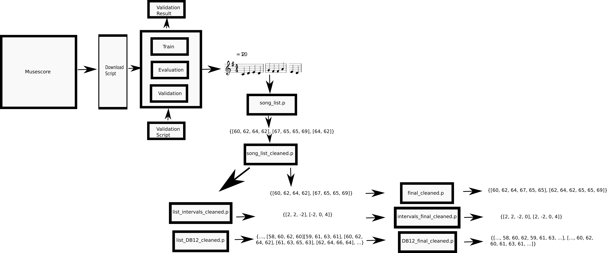
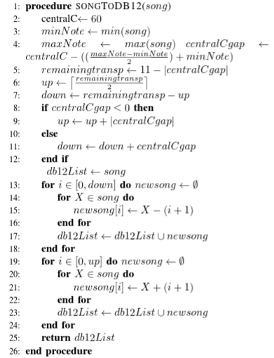

#  Generation of music midi files with a probabilistic generative model
Sebastián García Valencia

# Introduction

A particular kind of machine learning model with the capacity to generate information is known as a generative model. There are many variations, but all they focus on learning patterns in a dataset to then produce data with a given seed.

In this case, I will use a very simple generative probabilistic model called n-gram to generate midi sequences of music.

### Markov Chain
A Markov chain is a model that predicts the next event in a sequence based only on the present event, "forgetting" all the previous states.

### N-gram Model
An N-gram model is a probabilistic generative model which predicts the next sample in a sequence based on the previous n-1 samples. formaly

$$c = P(x_i | x_{i-(n-1)}, ..., x_{i-1})$$

It achieves this creating the n-grams for the input data, which consists of all the possible n-tuple of contiguous elements.

# Implementation
In my implementation of the model (in this case a for n=3, also known as trigram), the basic idea is to create prefixes and suffixes. Notice that I don't have an exception for the case that the suffix is already in the dictionary for a given key (prefix). I insert it multiple times on purpose, this the most straightforward way of achieving the probabilistic feature of the model. In the end, this dictionary of the prefixes with all the suffixes will be our trained model. The decision of use as corpus a list of strings is due to the ease to manipulate them and use them as key in dictionaries.


```python
import nltk
import random

# create a dict with the ngram model, it receives a list with the samples as string
ngram_dict = {}

def create_trigram_dict(corpus):
    n = 3
    ngrams = nltk.ngrams(corpus, n)
    
    for grams in ngrams:
        dict_key = grams[:-1][0] + " " + grams[:-1][1]
        if dict_key in ngram_dict:
            ngram_dict[dict_key].append(grams[-1])
        else:
            ngram_dict[dict_key] = []
            ngram_dict[dict_key].append(grams[-1])
```

To generate a sequence, it is necessary to use as seed an existent prefix in the model (this a disadvantage of n-grams models), then it will select one of the suffixes randomly, update the seed (deleting the first sample and inserting the new one) and begin the process again.


```python
def generate_trigram(seed, samples = 15):
    output = seed  
    for i in range(samples):
        # When it reaches the last prefix, there is no suffix, so end
        try:
            new_sample = random.choice(ngram_dict[seed])
        except:
            return output
        output += " " + new_sample
        seed = seed.split(" ")[1] + " " + new_sample

    return output
```


```python
word_corpus = 'am I a gram or am I a markov chain am I a gram only ... maybe I am both'
ngram_dict = {}
create_trigram_dict(word_corpus.split(" "))
ngram_dict
```


    {'... maybe': ['I'],
     'I a': ['gram', 'markov', 'gram'],
     'I am': ['both'],
     'a gram': ['or', 'only'],
     'a markov': ['chain'],
     'am I': ['a', 'a', 'a'],
     'chain am': ['I'],
     'gram only': ['...'],
     'gram or': ['am'],
     'markov chain': ['am'],
     'maybe I': ['am'],
     'only ...': ['maybe'],
     'or am': ['I']}


In example, the sentence 'am I a gram or am I a Markov chain am I a gram only ... maybe I am both' is used as the dataset. As you can see in the dictionary, the prefix 'I a' has 3 suffixes: 'gram', 'Markov' and 'gram' again. Here is the importance of insert repetitions, when you make a random choice over this list, 'gram' has a 66.6% of probability of being chosen, without the necessity of calculating this numbers.


```python
print generate_trigram("am I", 30)
```

    am I a gram or am I a gram or am I a gram only ... maybe I am both


```python
print generate_trigram("am I", 30)
```

    am I a markov chain am I a markov chain am I a gram or am I a gram or am I a gram or am I a gram only ... maybe


```python
print generate_trigram("markov chain", 30)
```

    markov chain am I a gram or am I a gram or am I a gram only ... maybe I am both


# The Music Dataset

To use the model as music generator, we will use a set of midi sequences. The starting point is the mono-MusicXML-dataset (https://github.com/EelcovdW/mono-MusicXML-dataset), this consists of 3 lists of keys (train, evaluation and validation) for monophonic songs in musescore, a repository for music sheet.

The procedure was to use these keys to download the songs in midi format. Then, I applied a series of cleaning and transformations to obtain an X and a Y array composed entirely by the integers representing the midi notes, focusing only in the sequence of notes and ignoring all the other features (time, tempo, etc.). The X corresponds to all the songs concatenated without the last element of each song, the Y to the same, but without the first note of each song, this can be used for an X -> Y type machine learning model.



For the case of this n-gram model, the data will be the x array of the validation dataset (around 2400 songs before transformations). To have more data, I applied a strategy of data augmentation, this usually done in computer vision, to generate a more significant dataset of images by rotating and translating the existent one. In this case, I transposed each song to have a version of it with each possible note as key note depending on how far is the song from central C and trying to spread the song the best possible through the midi range (0-127). The pseudo of this process is:



I provide the final dataset as a pickle.

### Loading and model creation
Let's load the dataset


```python
import pickle

midi_dataset = pickle.load(open("validation_DB12_final_cleaned.p", "rb"))
print("ready!!!")
```

    ready!!!


Trasnform it to a list of strings


```python
corpus = midi_dataset["x"]
corpus_str=map(str, corpus)
```

make the model and generate a song using C4 D4 as seed


```python
ngram_dict = {}
create_trigram_dict(corpus_str)
print("ready!!!")
```

    ready!!!


```python
generated_melody = generate_trigram("60 62", 40)
print(generated_melody)
```

    60 62 60 58 55 51 53 56 55 53 53 53 53 53 55 56 58 60 58 60 55 60 55 56 60 60 60 63 63 63 65 68 65 65 50 58 57 55 57 60 69 67


Finally, we can export the sequence as a midi file


```python
from midiutil.MidiFile import MIDIFile   

# takes a list of integers representing midi notes and creates a .mid
# with a contant time of a quarter note for all the notes and 120 
# as tempo(taken from garcia, 2018)
def sequenceVector2midiMelody(seqVector, file_dir):
    MyMIDI = MIDIFile(1)
    track = 0 
    time = 0
    MyMIDI.addTrackName(track,time,"Sample Track") 
    MyMIDI.addTempo(track,time,120)
    time = 0
    for note in seqVector:
        # MyMIDI.addNote(track,channel,pitch,time,duration,volume)
        MyMIDI.addNote(0,0,note,time,1,100)
        time = time + 1

    binfile = open(file_dir, 'wb') 
    MyMIDI.writeFile(binfile) 
    binfile.close()
```


```python
sequenceVector2midiMelody(map(int,generated_melody.split(" ")), 'generated_melody.mid')
```

### Visualize and listen to the midi
For the next part is necessary to have the musescore software installed, you can do it with the command sudo apt-get install musescore, and then replace the uri in the 2 lines of environment, it will usually be: "/usr/bin/musescore"


```python
from music21 import midi
import music21
music21.environment.set("musicxmlPath", "/usr/bin/musescore")
music21.environment.set('musescoreDirectPNGPath', '/usr/bin/musescore')

mid_file = midi.MidiFile()
mid_file.open("generated_melody.mid")
mid_file.read()
mid_file.close()
mid_stream = midi.translate.midiFileToStream(mid_file)
mid_stream.show()

print("Playing midi file .................")
sp = midi.realtime.StreamPlayer(mid_stream)
sp.play()
```


    Playing midi file .................


# Generalizing to n-gram

Easily we can generalize from the trigram above to an n-gram model, the larger the selected n the more context it will have into account, the disadventage is the necesity of using a seed that exist in the model, the larger the n, the difficult to find one. To see models without this weakness see my paper on music composition with Recurrent Neural Networks (right now it is in publishing proccess, as soon as it is available I will share it here)


```python
import nltk
import random

# create a dict with the ngram model, it receives a list with the samples as string, an the n pramater
# of the n-gram
ngram_dict = {}

def create_ngram_dict(corpus, n = 3):
    ngrams = nltk.ngrams(corpus, n)
    
    for grams in ngrams:
        dict_key = grams[:-1][0] 
        for i in range(1, n-1):
             dict_key += " " + grams[:-1][i]
        if dict_key in ngram_dict:
            ngram_dict[dict_key].append(grams[-1])
        else:
            ngram_dict[dict_key] = []
            ngram_dict[dict_key].append(grams[-1])
            
def generate_ngram(seed, samples = 15):
    output = seed  
    for i in range(samples):
        # When it reaches the last prefix, there is no suffix, so end
        try:
            new_sample = random.choice(ngram_dict[seed])
        except:
            return output
        output += " " + new_sample
        temp_seed = seed.split(" ")[1]
        #import pdb
        #pdb.set_trace()
        for sample in seed.split(" ")[2:]:
            temp_seed += " " + sample 
        seed = temp_seed + " " + new_sample

    return output            
```

Let's repeat the text example from the beginning, but with n = 5


```python
word_corpus = 'am I a gram or am I a markov chain am I a gram only ... maybe I am both'
ngram_dict = {}
create_ngram_dict(word_corpus.split(" "), 5)
ngram_dict
```


    {'... maybe I am': ['both'],
     'I a gram only': ['...'],
     'I a gram or': ['am'],
     'I a markov chain': ['am'],
     'a gram only ...': ['maybe'],
     'a gram or am': ['I'],
     'a markov chain am': ['I'],
     'am I a gram': ['or', 'only'],
     'am I a markov': ['chain'],
     'chain am I a': ['gram'],
     'gram only ... maybe': ['I'],
     'gram or am I': ['a'],
     'markov chain am I': ['a'],
     'only ... maybe I': ['am'],
     'or am I a': ['markov']}


```python
print generate_ngram("I a gram or", 30)
```

    I a gram or am I a markov chain am I a gram only ... maybe I am both


Finally, let's generate a music sequence using as seed the first sequence of notes of the major C scale, starting in central C (C4 D4 E4 F4)


```python
ngram_dict = {}
create_ngram_dict(corpus_str, 5)
print("ready!!!")
```

    ready!!!


```python
generated_melody = generate_ngram("60 62 64 65", 40)
print(generated_melody)
```

    60 62 64 65 67 67 65 67 69 71 72 74 76 76 74 71 72 74 76 77 77 74 76 74 72 82 81 73 74 77 81 79 76 73 69 67 64 67 69 73 76 79 82 69


# References

https://golang.org/doc/codewalk/markov/

https://en.wikipedia.org/wiki/Markov_chain

https://en.wikipedia.org/wiki/N-gram#n-gram_models

https://github.com/EelcovdW/mono-MusicXML-dataset

https://musescore.org
